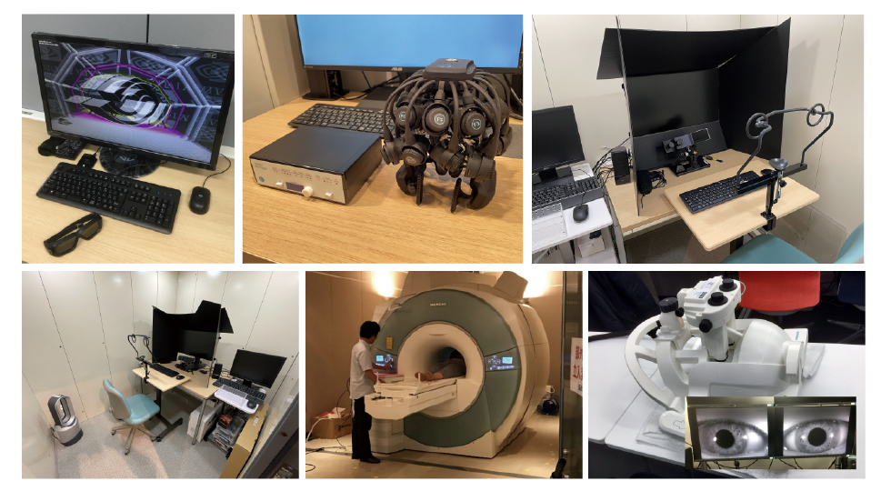
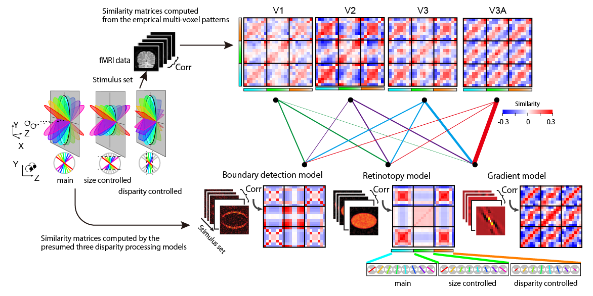
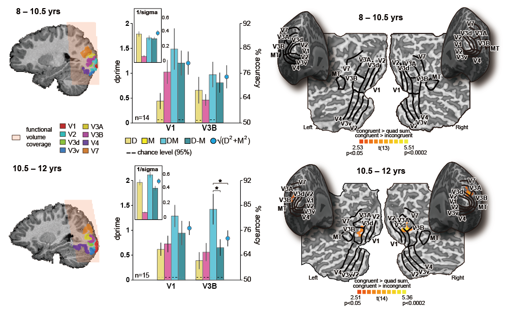

Created    : "2022-04-12 11:16:23 ban" 
Last Update: "2022-04-21 07:29:19 ban"

## Hi there. 👋 I am Hiroshi Ban, a psychologist/neuroscientist working at a research institute in Japan.  

Japanese version of README.md is available from [here.](README_ja.md)  
日本語版 README.mdは[こちら](README_ja.md)  

  

- **⌚ Born on April 5th**  
- **⛪ From Ichinomiya(Bisai) City, Aichi Prefecture, Japan**  
- **🌏 Living/had lived: Aichi, Tokyo, Kyoto, Osaka, Nara, and Birmingham, UK**  
- **🛴 Keywords: psychology, neuroscience, fMRI, MEG, psychophysics, vision, stereopsis, depth, 3D, virtual reality, VR, perception, recognition, cue integration, object, shape**  
- **☕ Favorites: curry (the headquarters of CoCo-Ichibanya, the most popular curry restaurant in Japan, is located in my hometown), spaghetti, ramen (Kamukura is the best to me right now), BBQ or Yakiniku (One-Karubi is the most amazing), dim sum, salad, coffee, oolong tea, pu'er tea, bicycle, traveling, sightseeing, watching movies**  

  

## Self Introduction  

My research focuses on human visual object perception and recognition. Specifically, using human neuroimaging techniques such as functional MRI, I am now investigating how 2D retinal inputs are translated into 3D depth structures, how local image features are integrated into a coherent visual object, how multiple and different visual clues are integrated, and how fragmental and incomplete visual inputs are compensated into a whole.  

A fundamental challenge in visual neuroscience/psychology is to understand the processes by which the outputs of neurons with spatially limited receptive fields are progressively transformed to encode information about objects at more extensive scales. Although our visual system tends to be often explained as an analogy of camera and photographs, our visual system actually has more capabilities to solve remarkably complicated problems that are far beyond the standard camera does. Therefore, to answer the questions above is very important not only to accumulate our basic knowledge in the neuroscience and psychology fields, but also to develop novel frameworks towards the future ICTs (Information and Communications Technologies).  

Recently, we have been further investigating human visual perception and cognitive functions when participants are viewing 3D images/movies in more natural (but complicated), and wide-field stereoscopic environments using the state-of-the-art VR (Virtual Reality) technologies. We have been also developing the related programs for these measurements by ourselves. Using such new devices and programs, for instance, we are trying to elucidate what cues are at least required for humans to feel a sense of “presence”, “immersion”, and “stereoscopic effect.” Is there a minimum unit that describes visual experience? Is it something that can be formulated and discussed quantitatively...? An old psychology paper once reported that it was only after color TV became popular that dreams, which used to be in black and white, became colored. It may (or would) be exactly right now that the advent of VR technology is changing the very shape of dreams again. Shall we join together in pursuing these latest technologies and the new research environments they bring?  

***Our group is always looking for undergraduate/graduate students and post-doctoral researchers who are interested in our research topics. Please feel free to contact us. Let’s do interesting collaborative studies together. Even if you just want to visit us like a “sightseeing”, you are more than welcome!***  

#### For those interested in our research group  

- **Research Theme:** Our research group has been looking for people who are interested in exploring the wonders of the human brain, especially visual information processing mechanisms. While stereoscopic vision and VR are listed in the Self-Introduction above as our main research themes, we are open to other topics as well, as long as they are interesting! It is preferred if applicants have any research experience in the fields of psychology, neuroscience, or information science, but we do not seriously require any detailed background. Rather, it is more essential that you are not afraid of programming, etc. (No experience is necessary, but your ***interest*** is important) and that you have ***passion***. Please do not hesitate to contact us.  
- **Research Target:** For those who are interested in modalities other than vision and who wish to pursue them, I am so sorry but I am afraid that I may not be able to provide appropriate guidance due to my limited knowledge and experience. Nevertheless, if you have a strong will to pursue your own research topic, even when you have to do it by yourself with lesser supports, if you need our research facilities and environment to pursue them, and if we can offer you some benefits, we will be happy to assist you.  
- **Language Skill:** The ability to communicate smoothly with other people in Japanese is desirable, but is not necessarily. We are happy to assist people who can only speak English with the help of our research assistants who can fluently translate between English and Japanese. If you are thus able to communicate at least in English, please do not worry at all about your Japanese language communication skills.  
- **Research Strategy and Environment:** Each member is expected to work on his/her own research theme, but I don't want to isolate individual projects (I mean that you will not be solely responsible for your own research alone); ideally, I would like to establish a system in which you and the other students/researchers work flexibly and cooperatively with each other. The research group will provide all the necessary spaces (your own desk and places for discussion etc), computers (PCs), hardwares/softwares for stimulus presentation and  response-etc measurement devices for your research projects. In spite of the current severe situation where budgets for basic research are continuously being cut, our research group will make every effort to cover at least the expenses necessary to carry out experiments.  
- **Finally**, if you have any questions, please do not hesitate and feel free to contact us anytime. We really look forward to meeting our future students and collaborators.  

  
*Despite advances in "imaging" technology, there is no difference in the basic structure between the left and right devices! For 150 years, only binocular disparity cues have been used to present stereoscopic images. There has been no innovation in terms of the use of stereoscopic cues. If we can somehow make better use of other stereoscopic cues, we may be able to provide a new technology to present more robust and more realistic stereoscopic images/movies at a lower cost. To achieve this goal, it is necessary to clarify what humans perceive and feel through vision and unveil the underlying neural mechanisms.*  

  
*Some of the equipments/devices we use in our research. Upper row, from left to right: 3D display with nVidia 3DVision2 Kit, Portable dry-electrode EEG system, Eye tracker. Lower row, from left to right: Behavior experiment cubicle, MRI, MR-compatible head-mounted-display and eye movement recording system during fMRI measurements*  

#### Looking for people who are willing to participate in our research/experiments  

Our group has been looking for people who are willing to participate in our research/experiments. All research procedures are reviewed and approved by our Ethics Committee in advance. The utmost cares are taken to ensure your privacy and health. All equipments are very safe, meeting various safety standards, and they will not harm your health. Each experiment takes approximately one to two hours. We will pay you an honorarium for your cooperation. If you are interested, please check the links below for more details.  

- **[SONA, Experiment Registration System](https://nict-cinet.sona-systems.com)**  
- **[SONA YouTube Manual](https://www.youtube.com/watch?v=_1OnT2ZU6QQ&ab_channel=SonaSystems)**  

## Recommended readings for our future students and post-doc researchers  

***Classics, but like Shakespeare, they will never fade away; we should follow them first.***  
1. Gibson, J.J. (2014, the original one was published in 1979). *The Ecological Approach to Visual Perception*. Routledge.  
2. Marr, D. (2010, the original one was published in 1982). *Vision: A computational investigation into the human representation and processing of visual information*. MIT press.  
3. Wandell, B. A. (1995). *Foundations of vision: Behavior, Neuroscience and Computation*. Sinauer Associates.  
   Publicly available now from the link [here](https://foundationsofvision.stanford.edu/).  
4. Zeki, S. (1993). *A vision of the brain*. Blackwell scientific publications.  
5. Gregory, R. L. (1973). *Eye and brain: The psychology of seeing*. McGraw-Hill.  

***Psychology, neuroscience, and neuroimaging***  
1. Gazzaniga, M.S., Irvy, R.B., Mangun, G.R. (2018). *Cognitive Neuroscience: The Biology of the Mind*. W W Norton & Co Inc.  
2. Huettel, S.A., Song, A.W., McCarthy, G. (2014). *Functional Magnetic Resonance Imaging*. Sinauer.  
3. Gibson, J.J. (2014). *The Ecological Approach to Visual Perception: Classic Edition*. Psychology Press.  
4. Kriegeskorte, N. and Kreiman, G. eds. (2012). *Visual population codes: toward a common multivariate framework for cell recording and functional imaging*. MIT press.  
5. Palmer, S.E. (1999). *Vision Science: Photons to Phenomenology*. Bradford Books.  

***Programming skills for vision science***
1. Cohen, M.X. (2017). *MATLAB for Brain and Cognitive Scientists*. MIT Press.  
2. Patterson, J. (2017). *Deep Learning: A Practitioner's Approach*. O'Reilly Media.  
3. VanderPlas, J. (2016). *Python Data Science Handbook: Essential Tools for Working with Data*. O'Reilly Media.  
   Publicly available now from the link [here](https://jakevdp.github.io/PythonDataScienceHandbook/)  
4. Wallisch et al. (2013). *MATLAB for Neuroscientists: An Introduction to Scientific Computing in MATLAB*. Academic Press.  
5. Gamma, J., Helm, E., Johnson, R., Vlissides, R. (2014). *Design Patterns: Elements of Reusable Object-Oriented Software*. Addison-Wesley Professional.  

***Japanese books***  
1. ブザーキ, G. (2019). 脳のリズム. みすず書房.  
2. 福山秀直 監訳. (2016). fMRI. メディカルサイエンスインターナショナル.  
3. 藤田一郎. (2015). 脳がつくる3D世界:立体視のなぞとしくみ. 化学同人.  
4. ノーマン, D.A. (2015). 誰のためのデザイン？ 増補・改訂版 ―認知科学者のデザイン原論. 新曜社.  
5. 池谷裕二. (2013). 単純な脳、複雑な「私」. 講談社.  
6. ギブソン, J.J. (2011). 生態学的知覚システム―感性をとらえなおす. 東京大学出版会  
7. パーカー, A. (2006). 眼の誕生――カンブリア紀大進化の謎を解く. 草思社.  
8. グレゴリー, R. (2001). 脳と視覚ーグレゴリーの視覚心理学. ブレーン出版.  
9. 下条信輔. (1996). サブリミナル・マインド. 中央公論新社.  
10. ゼキ, S. (1995). 脳のビジョン. 医学書院.  

***Papers***  
1. Cohen, M.A., Botch, T.L., Robertson, C.E. (2020). The limits of color awareness during active, real-world vision. ***Proceedings of the National Academy of Sciences***, 117(24), 13821-13827.  
2. Zhou, C., Han, M., Liang, Q., Hu, Y.F., Kuai, S.G. (2019). A social interaction field model accurately identifies static and dynamic social groupings. ***Nature Human Behaviour***, 3(8), 847-855.  
3. Chang, L., Tsao, D.Y. (2017). The code for facial identity in the primate brain. ***Cell***, 169(6), 1013-1028.  
4. Yamins, D.L., DiCarlo, J.J. (2016). Using goal-driven deep learning models to understand sensory cortex. ***Nature Neuroscience***, 19(3), 356-365.  
5. Glasser, M.F., Coalson, T.S., Robinson, E.C., Hacker, C.D., Harwell, J., Yacoub, E., ... Van Essen, D.C. (2016). A multi-modal parcellation of human cerebral cortex. ***Nature***, 536(7615), 171-178.  
6. Welchman, A.E. (2016). The human brain in depth: how we see in 3D. ***Annual Review of Vision Science***, 2, 345-376.  
7. Banks, M.S., Hoffman, D.M., Kin, J., Wetzstein, G. (2016). 3D Displays. ***Annual Review of Vision Science***, 2, 397-435.  
8. LeCun, Y., Bengio, Y., Hinton, G. (2015). Deep learning. ***Nature***, 521(7553), 436-444.  
9. Cichy, R.M., Pantazis, D., Oliva, A. (2014). Resolving human object recognition in space and time. ***Nature Neuroscience***, 17(3), 455-462.  
10. Orban, G.A. (2011). The extraction of 3D shape in the visual system of human and nonhuman primates. ***Annual Review of Neuroscience***, 34, 361-388.  
11. Kriegeskorte, N., Simmons, W. K., Bellgowan, P. S., & Baker, C. I. (2009). Circular analysis in systems neuroscience: the dangers of double dipping. ***Nature Neuroscience***, 12(5), 535-540.  
12. Kriegeskorte, N., Mur, M., Bandettini, P.A. (2008). Representational similarity analysis-connecting the branches of systems neuroscience. ***Frontiers in Systems Neuroscience***, 2, 4.  
13. Dumoulin, S.O., Wandell, B.A. (2008). Population receptive field estimates in human visual cortex. ***Neuroimage***, 39(2), 647-660.  
14. Grill-Spector, K., Henson, R., & Martin, A. (2006). Repetition and the brain: neural models of stimulus-specific effects. ***Trends in Cognitive Sciences***, 10(1), 14-23.  
15. Roelfsema, P.R. (2006). Cortical algorithms for perceptual grouping. ***Annual Review of Neuroscience***, 29, 203-227.  
16. Kamitani, Y., Tong, F. (2005). Decoding the visual and subjective contents of the human brain. ***Nature Neuroscience***, 8(5), 679-685.  
17. Kourtzi, Z., Kanwisher, N. (2001). Representation of perceived object shape by the human lateral occipital complex. ***Science***, 293(5534), 1506-1509.  
18. Kanwisher, N., McDermott, J., Chun, M.M. (1997). The fusiform face area: a module in human extrastriate cortex specialized for face perception. ***The Journal of Neuroscience***, 17(11), 4302-4311.  
19. Sereno, M.I., Dale, A.M., Reppas, J.B., Kwong, K.K., Belliveau, J.W., Brady, T.J., ... Tootell, R.B.H. (1995). Borders of multiple visual areas in humans revealed by functional magnetic resonance imaging. ***Science***, 268(5212), 889-893.  
20. Ohzawa, I., DeAngelis, G.C., Freeman, R.D. (1990). Stereoscopic depth discrimination in the visual cortex: neurons ideally suited as disparity detectors. ***Science***, 249(4972), 1037-1041.  

Please also check our publications listed below to know what we are doing.  

## Selected Publications  

1. Chang, D.H.F., Troje, N.F., Ikegaya, Y., Fujita, I., Ban, H. (2021). Spatiotemporal dynamics of responses to biological motion in the human brain. ***Cortex***. 136, 124-139. [[Link](https://www.sciencedirect.com/science/article/pii/S0010945221000010?via%3Dihub)]  
2. Armendariz, M., Ban, H., Welchman, A.E., Vanduffel, W. (2019). Areal differences in depth cue integration between monkey and human. ***PLOS Biology***, 17(3): e2006405. Doi:10.1371/journal.pbio.2006405 [[Link](https://journals.plos.org/plosbiology/article?id=10.1371/journal.pbio.2006405)]  
3. Funayama, K., Hagura, N., Ban, H., Ikegaya, Y. (2016). Functional Organization of Flash-induced V1 Offline Reactivation. ***The Journal of Neuroscience***, 36(46) 11727-11738. [[Link](https://www.jneurosci.org/content/36/46/11727)]  
4. Dekker, T., Ban, H., van der Velde, B., Sereno, M.I., Welchman, A.E., Narandini, M., (2015). Late development of cue integration is linked to sensory fusion in cortex. ***Current Biology***, 25(21), 2856–2861. [[Link](https://www.cell.com/current-biology/fulltext/S0960-9822(15)01154-9?_returnURL=https%3A%2F%2Flinkinghub.elsevier.com%2Fretrieve%2Fpii%2FS0960982215011549%3Fshowall%3Dtrue)]  
Please also see: [Sensory development: late integration of multiple cues](https://www.cell.com/current-biology/fulltext/S0960-9822(15)01159-8?_returnURL=https%3A%2F%2Flinkinghub.elsevier.com%2Fretrieve%2Fpii%2FS0960982215011598%3Fshowall%3Dtrue) and [Sensory Development: Childhood Changes in Visual Cortical Function](https://pubmed.ncbi.nlm.nih.gov/26766232/)  
5. Funayama, K., Minamisawa, G., Matsumoto, N., Ban, H., Chan, A.W., Matsuki, N., Murphy, T.H., Ikegaya, Y. (2015). Neocortical rebound depolarization enhances visual perception. ***PLOS Biology***, 13(8): e1002231. Doi:10.1371/journal.pbio.1002231. [[Link](https://journals.plos.org/plosbiology/article?id=10.1371/journal.pbio.1002231)]  
6. Ban, H., Welchman, A.E. (2015). fMRI analysis-by-synthesis reveals a dorsal hierarchy that extracts surface slant. ***The Journal of Neuroscience***, 35(27), 9823-9835. [[Link](https://www.jneurosci.org/content/35/27/9823.long)]  
7. Goncalves, N. R., Ban, H., Sanchez-Panchuel, R.M., Francis, S., Schluppeck, D., Welchman, A.E. (2015). Ultra-high field fMRI reveals systematic functional organization for binocular disparity in human visual cortex. ***The Journal of Neuroscience***, 35(7): 3056-3072. [[Link](https://www.jneurosci.org/content/35/7/3056.long)]  
8. Ban, H., Yamamoto, H. (2013). A non-device-specific approach to display characterization based on linear, non-linear, and hybrid search algorithms. ***Journal of Vision***, 13(6):20, 1-26. [[Link](https://jov.arvojournals.org/article.aspx?articleid=2121546)]  
You can download the developed software from here: https://github.com/hiroshiban/Mcalibrator2  
9. Ban, H., Yamamoto, H., Hanakawa, T., Urayama, S., Aso, T., Fukuyama, H., Ejima, Y. (2013). Topographic processing of an occluded object and the effects of spatiotemporal contexts in human early visual areas. ***The Journal of Neuroscience***, 33(43): 16992-17002. [[Link](https://www.jneurosci.org/content/33/43/16992)]  
10. Ban, H., Preston, T.J., Meeson, A., Welchman, A.E. (2012). The integration of motion and disparity cues to depth in the dorsal visual cortex. ***Nature Neuroscience***, 15(4), 636-643. *The contents of the publication was highlighted in "NEWS & VIEWS" in Nature Neuroscience 15(4).* [[Link](https://www.nature.com/articles/nn.3046)]  
Please also see: [Deep thinking](https://www.nature.com/articles/nn0412-506)
11. Ban, H., Yamamoto, H., Fukunaga, M., Nakagoshi, A., Umeda, M., Tanaka, C., Ejima, Y. (2006). Toward a common circle: interhemispheric contextual modulation in human early visual areas. ***The Journal of Neuroscience***, 26(34), 8804-8809. *Selected as "This Week in the Journal" paper.* [[Link](https://www.jneurosci.org/content/26/34/8804)]  

  
*Local binocular disparity cues are gradually integrated to represent surface slants/tilts along the presumed dorsal cortical hierarchy (Ban & Welchman 2015).*  

  
*Some change (development) in the visual area, V3B/KO, on the occipital/temporal cortex, after the age of 10.5 years, is necessary for children to be able to integrate depth cues like adults (e.g. binocular disparity and motion parallax). It has been said that binocular-stereoacuity, including the ability to adjust eye muscles and convergence angles, is completed around the age of 6. However, our results show that even after the age of 6, children's binocular-stereoacuity is not sufficient and is still under developing, taking longer period than previously expected (modified from Dekker, Ban, et al., 2015).*  

## Brief Biography  

***Education***  
2008 PhD. Graduate School of Human and Environmental Studies, Kyoto University, Japan  
2005 MA.  Graduate School of Human and Environmental Studies, Kyoto University, Japan  
2003 BS.  Faculty of Integrated Human Studies, Kyoto University, Japan  

***Work Experience***  
2021 Senior Researcher, CiNet, NICT, Japan  
2013 Guest Associate Professor, Graduate School of Frontier Biosciences, Osaka University, Japan  
2013 Researcher, CiNet, NICT, Japan  
2010-2013 JSPS Research Fellow to Study Abroad,  
&nbsp;&nbsp;&nbsp;&nbsp;&nbsp;School of Psychology, University of Birmingham, UK (Dr Zoe Kourtzi and Dr Andrew Welchman)  
2009-2010 Post-doctoral Researcher,  
&nbsp;&nbsp;&nbsp;&nbsp;&nbsp;School of Psychology, University of Birmingham, UK (Dr Zoe Kourtzi and Dr Andrew Welchman)  
2007-2009 Assistant Professor, Kokoro Research Center, Kyoto University, Japan  

  

## Awards  

2021 NICT In-house Award (as a member of the team to promote external/corporate collaborations)  
2020 HKU Social Sciences Outstanding Research Output Award (Basic Research) 2018-2019 (Hong-Kong, collaboration)  
2018 Poster Presentation Award, Social and Affective Neuroscience Society 2018 (collaboration)  
2017 Best Presentation Award, Human Neuroimaging Workshop (collaboration)  
2017 Travel Award (Vision Science Society, Annual Conference, 2017) (collaboration)  
2016 NICT In-house Award (as a member of the team to promote internationalization)  
2014 NICT Kansai 3 sites Joint Research Meeting, Research Encouragement Award (the first presenter)  
2011 Travel Award (Vision Science Society, Annual Conference, 2011) (collaboration)  
2007 Best Presentation Award, Japan Vision Science Society (the first presenter)  
2006 Human Communication Award, The Institute of Electronics, Information and Communication Engineers, Japan (the first presenter)  
2004 Human Communication Award, The Institute of Electronics, Information and Communication Engineers, Japan (the first presenter)  

## Main Collaborators  
**Dr Hiroki Yamamoto**, Kyoto University  
**Dr Dorita HF Chang**, University of Hong-Kong [Lab](https://www.changlab.hk/) [GitHub](https://github.com/dhfchang)  
**Dr Andrew E Welchman**, Cambridge University  

*My full CV is to be uploaded and available soon, maybe...*  

<!--
## Link to the ResearchGate personal page  
[Hiroshi Ban](https://www.researchgate.net/profile/Hiroshi-Ban)
-->
