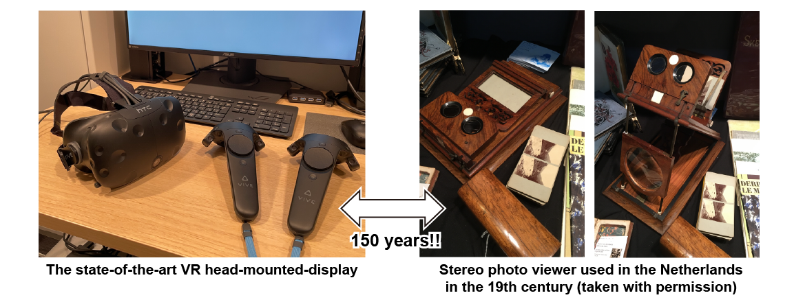
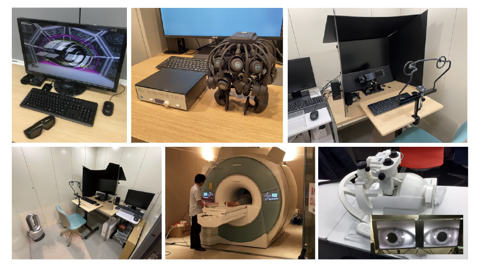
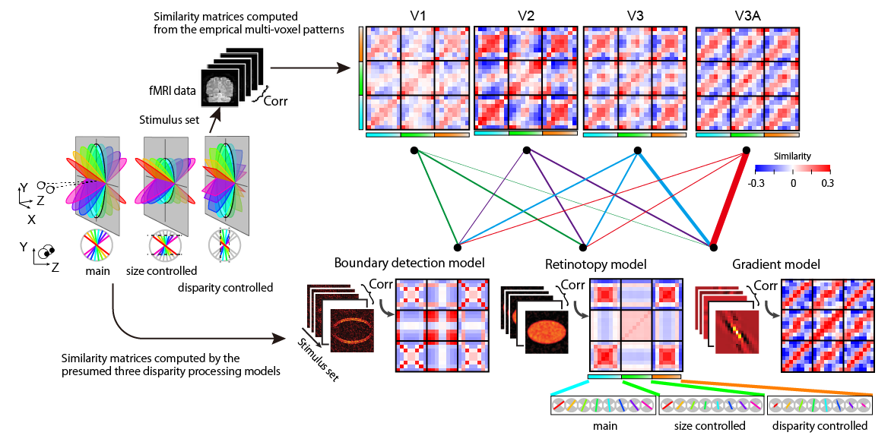
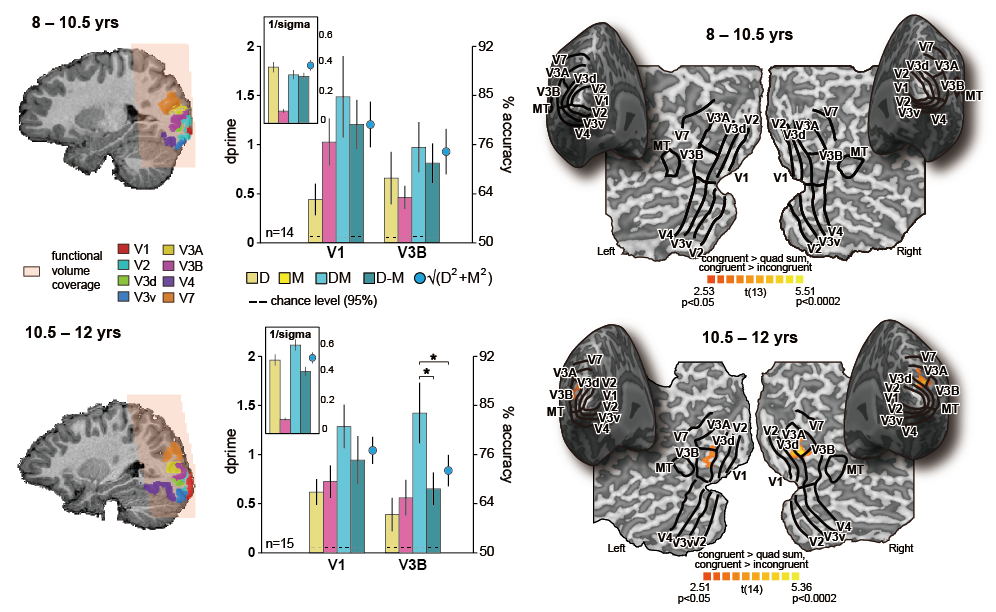
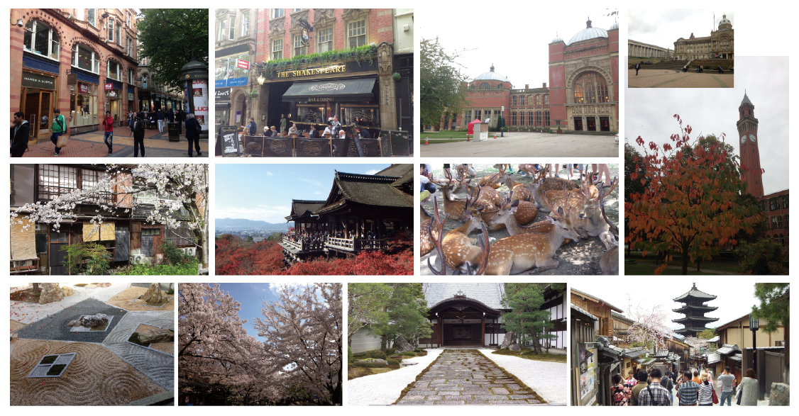

Created    : "2022-04-12 11:16:23 ban" 
Last Update: "2022-04-24 18:55:48 ban"

## はじめまして 👋 番浩志(ばんひろし)と申します。心理学・神経科学の研究者として日本の研究機関で働いております。  

English version of README.md is available from [here.](https://github.com/hiroshiban)  

  

- **⌚ 4月5日生まれ**
- **🏣 愛知県一宮市 (旧尾西市)出身**  
- **🌏 住んだことのある街: 愛知、東京、京都、大阪、奈良、香港 (ちょっとだけですが)、バーミンガム(英国)**  
- **🛴 研究キーワード: 心理学、神経科学、fMRI、MEG、心理物理学、視覚、立体視、奥行き、3D、バーチャルリアリティ、VR、知覚、認知、手掛かり統合、形態知覚**  
- **☕ 好きなもの: カレー (CoCo壱番屋本社は私が生まれた街にあるんです)、スパゲティ、ラーメン (神座が大好きです)、BBQ (焼肉ならワンカルビです)、飲茶、サラダ、コーヒー、烏龍茶、プーアル茶、自転車 (学生時代は輪行＆独り/友人とキャンプしながら愛知から京都、愛知から富士五湖など走破しました。ジャージー牛乳で有名な英国ジャージー島を半周したこともよい思い出です)、旅行、観光、映画鑑賞**  

## 自己紹介  

私は、ヒトの視知覚と物体認知機能に興味を持って研究をさせていただいております。特に、非侵襲的な脳機能イメージング手法(fMRIなど)を用いて、ヒト脳内で「2次元の網膜入力からどのように3次元構造が再構成されるのか」、「局所的な視覚情報はどのように大局的な物体構造へと統合されるのか」、「複数の異なる視覚手掛かりはどのように統合されているのか」、「断片的で不完全な視覚情報からどのように知覚像が補完されるのか」といった問題の解明に取り組んでおります。  

ヒトの後頭葉、視覚野に位置する個々のニューロン(神経細胞)は、空間的に限られたごく狭い範囲からしか入力を受けていません。それにもかかわらず、私たちは左右の眼を通して外界を即座に、途切れなくまとまった1つの全体として知覚できます。では、個々のニューロンの活動は脳内でどのように統合され、知覚へと至るのでしょうか？この謎は、視覚の神経科学・心理学が解かなければならない1つの重要な問いです。ヒトの視覚システムや知覚内容は、カメラや写真との比喩で説明されることが多いですが、実際にはヒトの視覚システムはカメラよりもはるかに高度で複雑な処理機構を持っています。ですから、上に挙げたような問題を明らかにすることは、神経科学・心理学の基礎的な知識を蓄積するとともに、未来の新しい情報通信技術(ICT: Information and Communications Technology)を開発することにも繋がる非常に重要な研究テーマです。  

最近は、VR(バーチャル・リアリティ)技術と3D映像や3D風景写真を用いて、より自然で広視野に及ぶ立体視環境でヒトの視知覚･認知機能を調べる研究や、そのための実験プログラムの開発も進めております。たとえば、ヒトが「臨場感」や「没入感」、そして「立体感」を得るためには、VR映像に最低どのような手掛かりがどれほど必要なのでしょうか？視覚経験を記述する最小単位はあるのでしょうか？それは数値化して議論できるものなのでしょうか…？昔の心理学の論文に、白黒だった夢に色がついたのはカラーテレビが普及してからだという報告があります。その真偽のほどはさておき、もしかしたらVR技術の登場でまさに今、夢の形が再び変わりつつあるのかもしれません。この最新技術とそれがもたらす新しい研究環境を一緒に探求しませんか。  

***私たちのグループではこうした研究にご興味をお持ちの学生の方々、ポスドク研究員の方々を随時募集しております。ぜひお気軽にご連絡ください。一緒に面白い共同研究をしましょう。見学だけでも大歓迎です。***  

#### 私たちの研究グループにご興味をお持ちの方へ  

- **研究テーマ：** 私たちの研究グループでは、ヒトの脳、特に視覚情報処理機構の不思議を一緒に探求してくださる方々を随時募集しております。上の自己紹介には立体視やVRが主なテーマとして挙げられておりますが、面白ければそれ以外のテーマでも大歓迎です。また、心理学、神経科学、あるいは情報科学の分野でのご研究経験があればスムーズに研究を開始できるかと思いますが、ご経歴は詳細には問いません。むしろ、プログラミング等に抵抗がない(未経験でも問題ございません。***ご興味***と***熱意***が重要です)ことの方が必須かもしれません。少しでもご興味がございましたら、ご遠慮なさらずぜひご一報ください。  
- **研究対象：** 視覚以外のモダリティにご興味をお持ちで、上述の内容とは異なるテーマを据えてご研究を進めたいとお考えの方々には、恐れ入りますが、私の知識と経験に限りがありますため、適切な指導をさせていただくことができないかもしれません。それでも、ご自身が主体となって1人で研究することになっても、そのテーマを追求したいという強い意志をお持ちで、そのテーマの追求に私どもの研究設備、環境が必要であり、私どもが何らかのメリットをご提供できるのでしたら、ご支援は惜しみません。  
- **言語能力：** 日本語で他者とスムーズにコミュニケーション可能であることが望ましいですが、これに関しても必須ではございません。英語だけしかお話できない方も、英日の通訳が可能な研究補助スタッフの支援のもと、問題なく研究を進めております。ですので、英語で基本的なコミュニケーションが可能であれば、日本語のスキルはご心配なさらず、ご連絡いただけましたら幸いです。  
- **研究体制・研究環境：** 各メンバーはそれぞれ独自の研究テーマに取り組んでいただきたいですが、決して個々のプロジェクトを孤立させることなく(お1人で全てを担うのではなく)、グループメンバでお互いに柔軟に協力しながらチームで研究を進めていただく体制を整えます。また、研究を遂行するために必要な場所(デスクおよび実験室)、計算機(PC)、実験機器・計測機器及び刺激呈示機器は、全て研究グループで準備し、ご提供いたします。基礎研究のための予算が削減され続ける昨今の厳しい状況ですが、少なくとも実験遂行に必要な経費は私どもの研究グループが責任を持って負担できますよう、尽力いたします。  
- **最後に：** 他にもご質問等がございましたら、どうぞご遠慮なさらず、いつでもご連絡ください。未来の学生のみなさま、共同研究者のみなさまとお目にかかれますのを楽しみにしております。  

  
*(左)最新のVR用ヘッドマウントディスプレイ、(右)150年前の立体写真観賞装置(許可を得て撮影)。映像技術の進歩はあれど、左右の装置で基本的な構造に違いはありません！150年もの年月に渡り、立体映像の呈示には両眼視差手掛かりしか用いられてきませんでした。立体視の手掛かりの利用法という観点からは、全く技術革新がなされてこなかったのです。他の立体視手掛かりをうまく利用することができれば、より低コストで、頑健で、かつ臨場感溢れる立体画像・映像を呈示する新しい技術を産み出すことができるかもしれません。そのためには、ヒトが映像から何を知覚しているのか、何を感じているのかを明らかにする必要があります。*  

  
*研究で使用している装置の一部を紹介いたします(上段左から右に)nVidia 3DVision2 Kitを用いた3D画像・映像提示システム、ポータブルEEG(脳波)計測システム、眼球運動計測システム。(下段左から右に)心理行動実験室の様子、MRIによる脳機能イメージング、fMRI脳機能イメージング実験互換のVRヘッドマウントディスプレイおよび眼球運動計測システム*  

#### 私たちの研究・実験にご参加いただける方々を募集しています  

私たちのグループでは、こうした研究・実験にご協力者としてご参加いただける方々を随時募集しております。研究手続きは全て事前に倫理委員会の審査を経て承認を得ており、ご参加いただくみなさまのプライバシー、ご安全に最大のご配慮をさせていただきます。また、使用する機材や計測機器も全て、種々の基準を満たしたとても安全なもので、みなさまのご健康を害することはございません。どうぞご安心してお気軽にご参加ください。1回の実験の所要時間はおよそ1～2時間程度で、ご協力いただいたみなさまには規定に沿って謝金もお支払いいたします。詳細は下記をご覧ください。  

- **[実験参加登録システム](https://nict-cinet.sona-systems.com)**  
- **[SONAシステム YouTubeマニュアル](https://www.youtube.com/watch?v=_1OnT2ZU6QQ&ab_channel=SonaSystems)**  

## 私たちの研究にご興味をお持ちの方々への推薦図書、論文  

***古典と言われるかもしれませんが、どれも決して色褪せない、とても重要な書籍です***  
1. Gibson, J.J. (2014, original one is published in 1979). *The Ecological Approach to Visual Perception*. Routledge.  
2. Marr, D. (2010, original one is published in 1982). *Vision: A computational investigation into the human representation and processing of visual information*. MIT press.  
3. Wandell, B.A. (1995). *Foundations of vision: Behavior, Neuroscience and Computation*. Sinauer Associates.  
   Publicly available now from the link [here](https://foundationsofvision.stanford.edu/).  
4. Zeki, S. (1993). *A vision of the brain*. Blackwell scientific publications.  
5. Gregory, R.L. (1973). *Eye and brain: The psychology of seeing*. McGraw-Hill.  

***心理学、神経科学、脳イメージング***  
1. Kandel, E.R., Koester, J.D., Mack, S.H., Siegelbausm, S.A. eds (2021). *Principles of Neural Science*. McGraw-Hill.  
2. Gazzaniga, M.S., Irvy, R.B., Mangun, G.R. (2018). *Cognitive Neuroscience: The Biology of the Mind*. W W Norton & Co Inc.  
3. Huettel, S.A., Song, A.W., McCarthy, G. (2014). *Functional Magnetic Resonance Imaging*. Sinauer.  
4. Kriegeskorte, N., Kreiman, G. eds. (2012). *Visual population codes: toward a common multivariate framework for cell recording and functional imaging*. MIT press.  
5. Palmer, S.E. (1999). *Vision Science: Photons to Phenomenology*. Bradford Books.  

***プログラミング (いくつかの本は日本語版も出ています)***
1. Cohen, M.X. (2017). *MATLAB for Brain and Cognitive Scientists*. MIT Press.  
2. Patterson, J. (2017). *Deep Learning: A Practitioner's Approach*. O'Reilly Media.  
3. VanderPlas, J. (2016). *Python Data Science Handbook: Essential Tools for Working with Data*. O'Reilly Media.  
   Publicly available now from the link [here](https://jakevdp.github.io/PythonDataScienceHandbook/)  
4. Wallisch et al. (2013). *MATLAB for Neuroscientists: An Introduction to Scientific Computing in MATLAB*. Academic Press.  
5. Gamma, J., Helm, E., Johnson, R., Vlissides, R. (2014). *Design Patterns: Elements of Reusable Object-Oriented Software*. Addison-Wesley Professional.  

***日本語の本***  
1. ブザーキ, G. (2019). 脳のリズム. みすず書房.  
2. 福山秀直 監訳. (2016). fMRI. メディカルサイエンスインターナショナル.  
3. 藤田一郎. (2015). 脳がつくる3D世界:立体視のなぞとしくみ. 化学同人.  
4. ノーマン, D.A. (2015). 誰のためのデザイン？ 増補・改訂版 ―認知科学者のデザイン原論. 新曜社.  
5. 池谷裕二. (2013). 単純な脳、複雑な「私」. 講談社.  
6. ギブソン, J.J. (2011). 生態学的知覚システム―感性をとらえなおす. 東京大学出版会  
7. パーカー, A. (2006). 眼の誕生――カンブリア紀大進化の謎を解く. 草思社.  
8. グレゴリー, R. (2001). 脳と視覚ーグレゴリーの視覚心理学. ブレーン出版.  
9. 下条信輔. (1996). サブリミナル・マインド. 中央公論新社.  
10. ゼキ, S. (1995). 脳のビジョン. 医学書院.  

***論文***  
1. Cohen, M.A., Botch, T.L., Robertson, C.E. (2020). The limits of color awareness during active, real-world vision. ***Proceedings of the National Academy of Sciences***, 117(24), 13821-13827.  
2. Zhou, C., Han, M., Liang, Q., Hu, Y.F., Kuai, S.G. (2019). A social interaction field model accurately identifies static and dynamic social groupings. ***Nature Human Behaviour***, 3(8), 847-855.  
3. Chang, L., Tsao, D.Y. (2017). The code for facial identity in the primate brain. ***Cell***, 169(6), 1013-1028.  
4. Yamins, D.L., DiCarlo, J.J. (2016). Using goal-driven deep learning models to understand sensory cortex. ***Nature Neuroscience***, 19(3), 356-365.  
5. Glasser, M.F., Coalson, T.S., Robinson, E.C., Hacker, C.D., Harwell, J., Yacoub, E., ... Van Essen, D.C. (2016). A multi-modal parcellation of human cerebral cortex. ***Nature***, 536(7615), 171-178.  
6. Welchman, A.E. (2016). The human brain in depth: how we see in 3D. ***Annual Review of Vision Science***, 2, 345-376.  
7. Banks, M.S., Hoffman, D.M., Kin, J., Wetzstein, G. (2016). 3D Displays. ***Annual Review of Vision Science***, 2, 397-435.  
8. LeCun, Y., Bengio, Y., Hinton, G. (2015). Deep learning. ***Nature***, 521(7553), 436-444.  
9. Cichy, R.M., Pantazis, D., Oliva, A. (2014). Resolving human object recognition in space and time. ***Nature Neuroscience***, 17(3), 455-462.  
10. Orban, G.A. (2011). The extraction of 3D shape in the visual system of human and nonhuman primates. ***Annual Review of Neuroscience***, 34, 361-388.  
11. Kriegeskorte, N., Simmons, W.K., Bellgowan, P.S., Baker, C.I. (2009). Circular analysis in systems neuroscience: the dangers of double dipping. ***Nature Neuroscience***, 12(5), 535-540.  
12. Kriegeskorte, N., Mur, M., Bandettini, P.A. (2008). Representational similarity analysis-connecting the branches of systems neuroscience. ***Frontiers in Systems Neuroscience***, 2, 4.  
13. Dumoulin, S.O., Wandell, B.A. (2008). Population receptive field estimates in human visual cortex. ***Neuroimage***, 39(2), 647-660.  
14. Grill-Spector, K., Henson, R., & Martin, A. (2006). Repetition and the brain: neural models of stimulus-specific effects. ***Trends in Cognitive Sciences***, 10(1), 14-23.  
15. Roelfsema, P.R. (2006). Cortical algorithms for perceptual grouping. ***Annual Review of Neuroscience***, 29, 203-227.  
16. Kamitani, Y., Tong, F. (2005). Decoding the visual and subjective contents of the human brain. ***Nature Neuroscience***, 8(5), 679-685.  
17. Kourtzi, Z., Kanwisher, N. (2001). Representation of perceived object shape by the human lateral occipital complex. ***Science***, 293(5534), 1506-1509.  
18. Kanwisher, N., McDermott, J., Chun, M.M. (1997). The fusiform face area: a module in human extrastriate cortex specialized for face perception. ***The Journal of Neuroscience***, 17(11), 4302-4311.  
19. Sereno, M.I., Dale, A.M., Reppas, J.B., Kwong, K.K., Belliveau, J.W., Brady, T.J., ... Tootell, R.B.H. (1995). Borders of multiple visual areas in humans revealed by functional magnetic resonance imaging. ***Science***, 268(5212), 889-893.  
20. Ohzawa, I., DeAngelis, G.C., Freeman, R.D. (1990). Stereoscopic depth discrimination in the visual cortex: neurons ideally suited as disparity detectors. ***Science***, 249(4972), 1037-1041.  

下記、私たちのグループの主要な研究論文もご参照ください。  

## 主要な研究論文  

1. Chang, D.H.F., Troje, N.F., Ikegaya, Y., Fujita, I., Ban, H. (2021). Spatiotemporal dynamics of responses to biological motion in the human brain. ***Cortex***. 136, 124-139. [[Link](https://www.sciencedirect.com/science/article/pii/S0010945221000010?via%3Dihub)]  
2. Armendariz, M., Ban, H., Welchman, A.E., Vanduffel, W. (2019). Areal differences in depth cue integration between monkey and human. ***PLOS Biology***, 17(3): e2006405. Doi:10.1371/journal.pbio.2006405 [[Link](https://journals.plos.org/plosbiology/article?id=10.1371/journal.pbio.2006405)]  
3. Funayama, K., Hagura, N., Ban, H., Ikegaya, Y. (2016). Functional Organization of Flash-induced V1 Offline Reactivation. ***The Journal of Neuroscience***, 36(46) 11727-11738. [[Link](https://www.jneurosci.org/content/36/46/11727)]  
4. Dekker, T., Ban, H., van der Velde, B., Sereno, M.I., Welchman, A.E., Narandini, M., (2015). Late development of cue integration is linked to sensory fusion in cortex. ***Current Biology***, 25(21), 2856–2861. [[Link](https://www.cell.com/current-biology/fulltext/S0960-9822(15)01154-9?_returnURL=https%3A%2F%2Flinkinghub.elsevier.com%2Fretrieve%2Fpii%2FS0960982215011549%3Fshowall%3Dtrue)]  
こちらもご覧ください: [Sensory development: late integration of multiple cues](https://www.cell.com/current-biology/fulltext/S0960-9822(15)01159-8?_returnURL=https%3A%2F%2Flinkinghub.elsevier.com%2Fretrieve%2Fpii%2FS0960982215011598%3Fshowall%3Dtrue) and [Sensory Development: Childhood Changes in Visual Cortical Function](https://pubmed.ncbi.nlm.nih.gov/26766232/)  
5. Funayama, K., Minamisawa, G., Matsumoto, N., Ban, H., Chan, A.W., Matsuki, N., Murphy, T.H., Ikegaya, Y. (2015). Neocortical rebound depolarization enhances visual perception. ***PLOS Biology***, 13(8): e1002231. Doi:10.1371/journal.pbio.1002231. [[Link](https://journals.plos.org/plosbiology/article?id=10.1371/journal.pbio.1002231)]  
6. Ban, H., Welchman, A.E. (2015). fMRI analysis-by-synthesis reveals a dorsal hierarchy that extracts surface slant. ***The Journal of Neuroscience***, 35(27), 9823-9835. [[Link](https://www.jneurosci.org/content/35/27/9823.long)]  
7. Goncalves, N. R., Ban, H., Sanchez-Panchuel, R.M., Francis, S., Schluppeck, D., Welchman, A.E. (2015). Ultra-high field fMRI reveals systematic functional organization for binocular disparity in human visual cortex. ***The Journal of Neuroscience***, 35(7): 3056-3072. [[Link](https://www.jneurosci.org/content/35/7/3056.long)]  
8. Ban, H., Yamamoto, H. (2013). A non-device-specific approach to display characterization based on linear, non-linear, and hybrid search algorithms. ***Journal of Vision***, 13(6):20, 1-26. [[Link](https://jov.arvojournals.org/article.aspx?articleid=2121546)]  
公開したソフトウェアは次のリンクよりダウンロード、お試しいただけます: https://github.com/hiroshiban/Mcalibrator2  
9. Ban, H., Yamamoto, H., Hanakawa, T., Urayama, S., Aso, T., Fukuyama, H., Ejima, Y. (2013). Topographic processing of an occluded object and the effects of spatiotemporal contexts in human early visual areas. ***The Journal of Neuroscience***, 33(43): 16992-17002. [[Link](https://www.jneurosci.org/content/33/43/16992)]  
10. Ban, H., Preston, T.J., Meeson, A., Welchman, A.E. (2012). The integration of motion and disparity cues to depth in the dorsal visual cortex. ***Nature Neuroscience***, 15(4), 636-643. *The contents of the publication was highlighted in "NEWS & VIEWS" in Nature Neuroscience 15(4).* [[Link](https://www.nature.com/articles/nn.3046)]  
こちらもご覧ください: [Deep thinking](https://www.nature.com/articles/nn0412-506)
11. Ban, H., Yamamoto, H., Fukunaga, M., Nakagoshi, A., Umeda, M., Tanaka, C., Ejima, Y. (2006). Toward a common circle: interhemispheric contextual modulation in human early visual areas. ***The Journal of Neuroscience***, 26(34), 8804-8809. *Selected as "This Week in the Journal" paper.* [[Link](https://www.jneurosci.org/content/26/34/8804)]  

  
*視覚野の階層性に沿って両眼視差が統合されていく様子(Ban & Welchman, 2015より改変)。*  

  
*子どもが奥行き手掛かり(両眼視差と運動視差など)を大人のように統合できるようになるには、10.5歳を過ぎた頃の脳の視覚野、V3B/KOの変化(発達)が必要であることが示されました(Dekker, Ban, et al., 2015より改変)。眼筋や輻輳角の調整機能など、「外から見える」立体視能力は6歳頃に完成するといわれてきましたが、この研究結果は、6歳を経た後も子どもの立体視能力は十分ではなく、大人と同じようには機能せず、脳がまだ発達を続けていることを示しています。*  

## 略歴  

***学位等***  
2008 博士(人間・環境学) 京都大学大学院人間・環境学研究科  
2005 修士(人間・環境学) 京都大学大学院人間・環境学研究科  
2003 学士 京都大学総合人間学部基礎科学科  

***職歴***  
2021 情報通信研究機構(NICT) 脳情報通信融合研究センター 主任研究員  
2013 大阪大学 大学院・生命機能研究科 招へい准教授  
2013 情報通信研究機構(NICT) 脳情報通信融合研究センター 研究員  
2010-2013 日本学術振興会 海外特別研究員  
&nbsp;&nbsp;&nbsp;&nbsp;&nbsp;(英国バーミンガム大学心理学部 研究員 (Zoe Kourtzi博士、Andrew Welchman博士))  
2009-2010 英国バーミンガム大学心理学部 研究員 (Zoe Kourtzi博士、Andrew Welchman博士)  
2007-2009 京都大学こころの未来研究センター 助教  

  

## 受賞  

2021 令和2年度情報通信研究機構 部内表彰 (団体、脳情報通信融合研究センター外部・企業連携チームの1員として)  
2020 HKU Social Sciences Outstanding Research Output Award (Basic Research) 2018-2019 (香港、共同発表)  
2018 Poster Presentation Award, Social and Affective Neuroscience Society (共同発表)  
2017 Best Presentation Award, Human Neuroimaging Workshop (ヒト脳機能イメージング研究会) (共同発表)  
2017 Travel Award (Vision Science Society, Annual Conference, 2017) (共同発表)  
2016 平成27年度情報通信研究機構 部内表彰 (団体、脳情報通信融合研究センター国際化チームの1員として)  
2014 NICT関西３拠点合同研究会 研究奨励賞 (筆頭発表者)  
2011 Travel Award (Vision Science Society, Annual Conference, 2011) (共同発表)  
2007 日本視覚学会ベストプレゼンテーション賞 (筆頭発表者)  
2006 電子情報通信学会 ヒューマンコミュニケーション賞 (筆頭発表者)  
2004 電子情報通信学会 ヒューマンコミュニケーション賞 (筆頭発表者)  

## 主な共同研究者  
**山本洋紀 博士**, 京都大学  
**Dorita HF Chang (張暁楓) 博士**, 香港大学 [Lab](https://www.changlab.hk/) [GitHub](https://github.com/dhfchang)  
**Andrew E Welchman 博士**, ケンブリッジ大学  

*完全なCVは近々公開させていただきます…*  

<!--
## ResearchGateの個人ページへのリンク  
[Hiroshi Ban](https://www.researchgate.net/profile/Hiroshi-Ban)
-->
